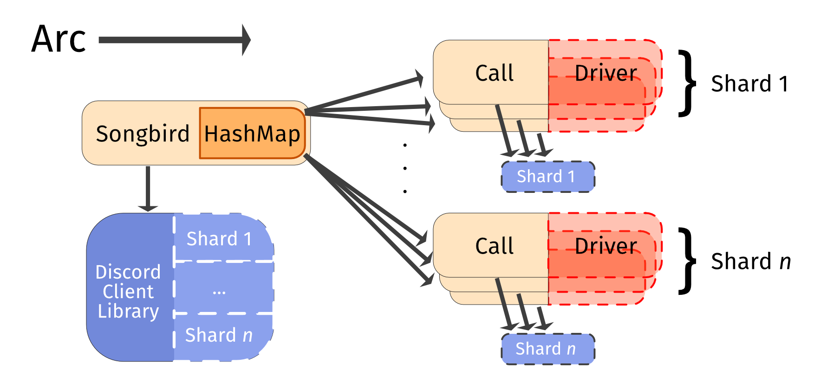
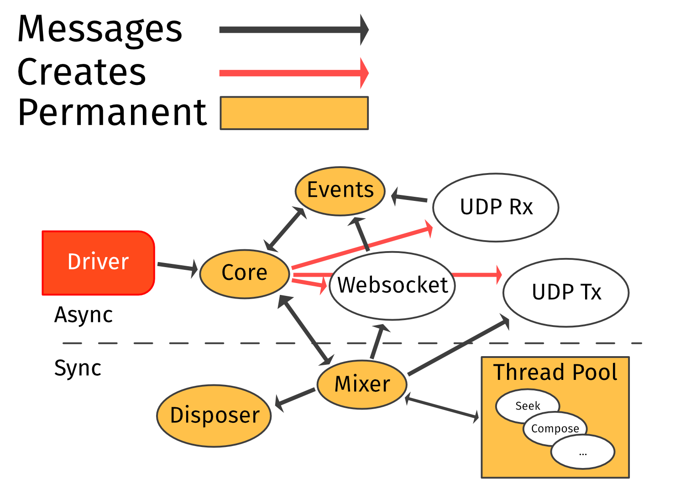
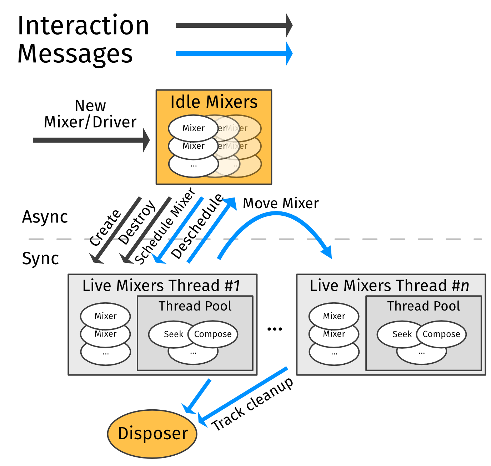

# Summary
Songbird defines two main systems:
* The **gateway**, which communicates with Discord through another client library. This sends voice state updates to join a voice channel, and correlates responses into voice connection info.
* The **driver**, which uses voice connection info to establish an RTP connection and WS signalling channel to send and receive audio. It then manages audio mixing, audio source management, event tracking, and voice packet reception.

Songbird allows users to use one or both of these systems as needed.
Discord voice connections ultimately require both of these to be handled in some way.
In many setups for instance, this comes through using a client-specific wrapper in a bot's host language to collect connection information to send to Lavalink/Lavaplayer, hosted on the JVM.

# Gateway
Songbird's **gateway** is an async system, typically managed by a top-level `Songbird` struct, which holds `Arc` pointers to a Discord client library instance (that it can request individual shard references from).
This maps all `ChannelID`s into `Call` state.
New `Call`s are created as needed, requesting the shard that each `ChannelID` belongs to from the main client.

When asked to join a voice channel, a `Call` communicates with Discord over the shard handle, collates Discord's responses, and produces a `ConnectionInfo` with session information.
If the driver feature is enabled, then every `Call` is/has an associated `Driver`, and this connection info is passed on to its inner tasks.



```
src/manager.rs
src/handler.rs
src/serenity.rs
src/join.rs
```

# Driver
Songbird's **driver** is a mixed sync/async system for running voice connections.
Audio processing remains synchronous for the following reasons:
* Encryption, encoding, and mixing are compute bound tasks which cannot be subdivided cleanly by the Tokio executor. Having these block the scheduler's finite thread count has a significant impact on servicing other tasks.
* `Read` and `Seek` are considerably more user-friendly to use, implement, and integrate than `AsyncRead`, `AsyncBufRead`, and `AsyncSeek`.
* Symphonia implements all of its functionality based on synchronous I/O.

## Tasks
Songbird subdivides voice connection handling into several long- and short-lived tasks.

* **Core**: Handles and directs commands received from the driver. Responsible for connection/reconnection, and creates network tasks.
* **Mixer**: Combines audio sources together, Opus encodes the result, and encrypts the built packets every 20ms. Responsible for handling track commands/state, and transmitting completed voice packets and keepalive messages. ***Synchronous when live***.
* **Thread Pool**: A dynamically sized thread-pool for I/O tasks. Creates lazy tracks using `Compose` if sync creation is needed, otherwise spawns a tokio task. Seek operations always go to the thread pool. ***Synchronous***.
* **Disposer**: Used by mixer thread to dispose of data with potentially long/blocking `Drop` implementations (i.e., audio sources). ***Synchronous***.
* **Events**: Stores and runs event handlers, tracks event timing, and handles 
* **Websocket**: *Network task.* Sends speaking status updates and keepalives to Discord, and receives client (dis)connect events.
* **UDP Rx**: *Optional network task.* Decrypts/decodes received voice packets and statistics information.

*Note: all tasks are able to message the permanent tasks via a block of interconnecting channels.*



## Scheduler
To save threads and memory (e.g., packet buffer allocations), Songbird parks Mixer tasks which do not have any live Tracks.
These are all co-located on a single async task.
This task is responsible for managing UDP keepalive messages for each task, maintaining event state, and executing any Mixer task messages.
Whenever any message arrives which adds a `Track`, the mixer task is moved to a live thread.
The Idle task inspects task counts and execution time on each thread, choosing the first live thread with room, creating a new one if needed.

Each live thread is responsible for running as many live mixers as it can in a single tick every 20ms: this currently defaults to 16 mixers per thread, but is user-configurable.
A live thread also stores RTP packet blocks to be written into by each sub-task.
Audio threads have a budget of 20ms to complete all message handling, mixing, encoding, and encryption.
*These threads are synchronous, as explained above: the bulk costs (i.e., encoding) are compute-bound work and would block the Tokio executor.*
Mixer logic is handled in this order to minimise deadline variance:
```
handle idle->live messages
handle all driver->mixer messages
cleanup idle/dead mixers
mix + encode + encrypt all mixers into packet buffer
check for excess packet blocks
sleep 'til next 20ms boundary

send all packets, adjust RTP fields
handle per-track messages
```
Each live thread has a conservative limit of 18ms that it will aim to stay under: if all work takes longer than this, it will offload the task with the highest mixing cost once per 20ms tick.



```
src/driver/*
```

## Audio handling

### Input
Inputs are audio sources supporting lazy initialisation, being either:
* **lazy inputs**—a trait object which allows an instructions to create an audio source to be cheaply stored. This will be initialised when needed either synchronously or asynchronously based on what which methods the trait object supports.
* **live inputs**—a usable audio object implementing `MediaSource: Read + Seek`. `Seek` support may be dummied in, as seek use and support is gated by `MediaSource`. These can be passed in at various stages of processing by symphonia.

Several wrappers exist to add `Seek` capabilities to one-way streams via storage or explicitly recreating the struct, `AsyncRead` adapters, and raw audio input adapters.

Internally, the mixer uses floating-point audio to prevent clipping and allow more granular volume control.
Symphonia is used to demux and decode input files in a variety of formats into this floating-point buffer: songbird supports all codecs and containers which are part of the symphonia project, while adding support for Opus decoding and DCA1 container files.
If a source uses the Opus codec (and is the only source), then it can bypass mixing and re-encoding altogether, saving CPU cycles per server.

```
src/input/*
```

### Tracks
Tracks hold additional state which is expected to change over the lifetime of a track: position, play state, and modifiers like volume.
Tracks (and their handles) also allow per-source events to be inserted.

Tracks are defined in user code, where they are fully modifiable, before being passed into the driver.
From this point, all changes and requests are serviced via commands over a `TrackHandle` (so that the audio thread never locks or blocks during user modification).

Tracks and Inputs typically exist in a 1:1 relationship, though many Inputs may reference the same backing store.

```
src/tracks/*
```

## Events
Event handlers are stored on a per-track and global basis, with events being supplied by other tasks in the driver.
These event handlers are boxed trait objects, each subscribed to an individual event type.
The event type and data are supplied when this generic handler is called, allowing reuse of event handlers between subscriptions (i.e., via `Arc`).

Timed events are driven by "tick" messages sent by the mixer (so that both tasks' view of track state remains in sync), while other event types are set individually (but often fired in batches).
Global events fire in response to other tasks, or the main "tick".

```
src/events/*
```
