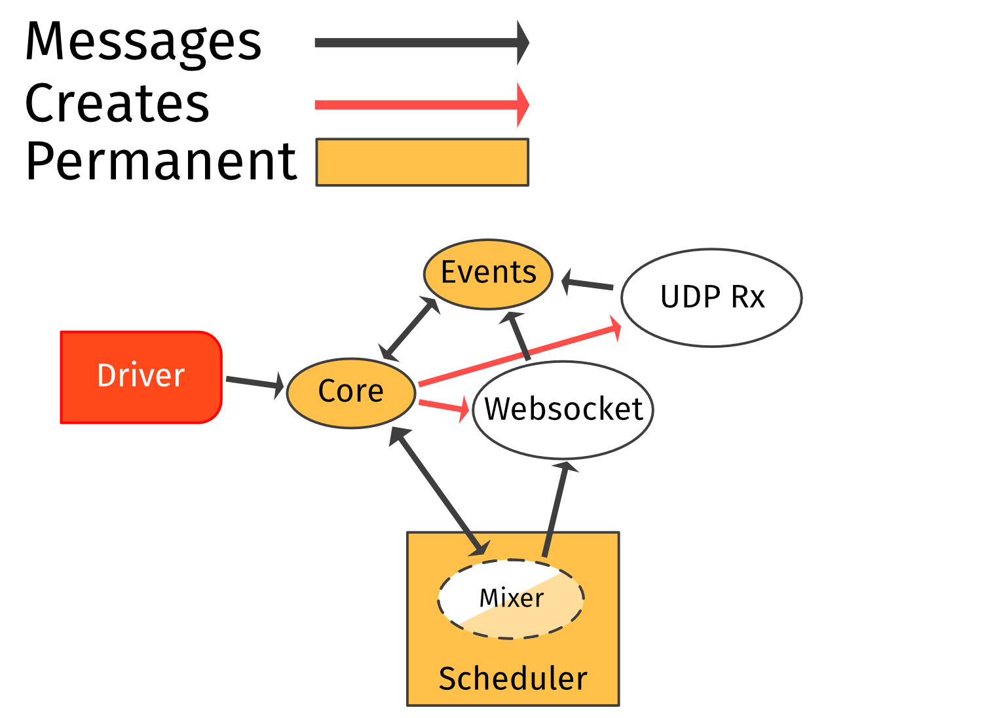

# Summary
Songbird defines two main systems:
* The **gateway**, which communicates with Discord through another client library. This sends voice state updates to join a voice channel, and correlates responses into voice connection info.
* The **driver**, which uses voice connection info to establish an RTP connection and WS signalling channel to send and receive audio. It then manages audio mixing, audio source management, event tracking, and voice packet reception.

Songbird allows users to use one or both of these systems as needed.
Discord voice connections ultimately require both of these to be handled in some way.
In many setups for instance, this comes through using a client-specific wrapper in a bot's host language to collect connection information to send to Lavalink/Lavaplayer, hosted on the JVM.

# Gateway
Songbird's **gateway** is an async system, typically managed by a top-level `Songbird` struct, which holds `Arc` pointers to a Discord client library instance (that it can request individual shard references from).
This maps all `ChannelID`s into `Call` state.
New `Call`s are created as needed, requesting the shard that each `ChannelID` belongs to from the main client.

When asked to join a voice channel, a `Call` communicates with Discord over the shard handle, collates Discord's responses, and produces a `ConnectionInfo` with session information.
If the driver feature is enabled, then every `Call` is/has an associated `Driver`, and this connection info is passed on to its inner tasks.


```
src/manager.rs
src/handler.rs
src/serenity.rs
src/join.rs
```

# Driver
Songbird's **driver** is a mixed sync/async system for running voice connections.
Audio processing remains synchronous for the following reasons:
* Encryption, encoding, and mixing are compute bound tasks which cannot be subdivided cleanly by the Tokio executor. Having these block the scheduler's finite thread count has a significant impact on servicing other tasks.
* `Read` and `Seek` are considerably more user-friendly to use, implement, and integrate than `AsyncRead`, `AsyncBufRead`, and `AsyncSeek`.

## Tasks
Songbird subdivides voice connection handling into several long- and short-lived tasks.

* **Core**: Handles and directs commands received from the driver. Responsible for connection/reconnection, and creates network tasks.
* **Mixer**: Combines audio sources together, Opus encodes the result, and encrypts the built packets every 20ms. Responsible for handling track commands/state. ***Synchronous***.
* **Disposer**: Used by mixer thread to dispose of data with potentially long/blocking `Drop` implementations (i.e., audio sources). ***Synchronous***.
* **Events**: Stores and runs event handlers, tracks event timing, and handles 
* **Websocket**: *Network task.* Sends speaking status updates and keepalives to Discord, and receives client (dis)connect events.
* **UDP Tx**: *Network task.* Responsible for transmitting completed voice packets.
* **UDP Rx**: *Network task.* Decrypts/decodes received voice packets and statistics information.

*Note: all tasks are able to message the permanent tasks via a block of interconnecting channels.*



```
src/driver/*
```

## Audio handling

### Input
Inputs are raw audio sources: composed of a `Reader` (which can be `Read`-only or `Read + Seek`), a framing mechanism, and a codec.
Several wrappers exist to add `Seek` capabilities to one-way streams via storage or explicitly recreating the struct.

Framing is not always needed (`Raw`), but makes it possible to consume the correct number of bytes needed to decode one audio packet (and/or simplify skipping through the stream).
Currently, Opus and raw (`i16`/`f32`) audio sources are supported, though only the DCA framing for Opus is implemented.
At present, the use of the FFmpeg executable allows us to receive raw input, but at heavy memory cost.
Further implementations are possible in the present framework (e.g., WebM/MKV and Ogg containers, MP3 and linked FFI FFmpeg as codecs).

Internally, the mixer uses floating-point audio to prevent clipping and allow more granular volume control.
If a source is known to use the Opus codec (and is the only source), then it can bypass mixing altogether.

```
src/input/*
```

### Tracks
Tracks hold additional state which is expected to change over the lifetime of  a track: position, play state, and modifiers like volume.
Tracks (and their handles) also allow per-source events to be inserted.

Tracks are defined in user code, where they are fully modifiable, before being passed into the driver.
From this point, all changes and requests are serviced via commands over a `TrackHandle` (so that the audio thread never locks or blocks during user modification).

Tracks and Inputs typically exist in a 1:1 relationship, though many Inputs may reference the same backing store.

```
src/tracks/*
```

## Events
Event handlers are stored on a per-track and global basis, with events being supplied by other tasks in the driver.
These event handlers are boxed trait objects, each subscribed to an individual event type.
The event type and data are supplied when this generic handler is called, allowing reuse of event handlers between subscriptions (i.e., via `Arc`).

Timed events are driven by "tick" messages sent by the mixer (so that both tasks' view of track state remains in sync), while other event types are set individually (but often fired in batches).
Global events fire in response to other tasks, or the main "tick".

```
src/events/*
```
