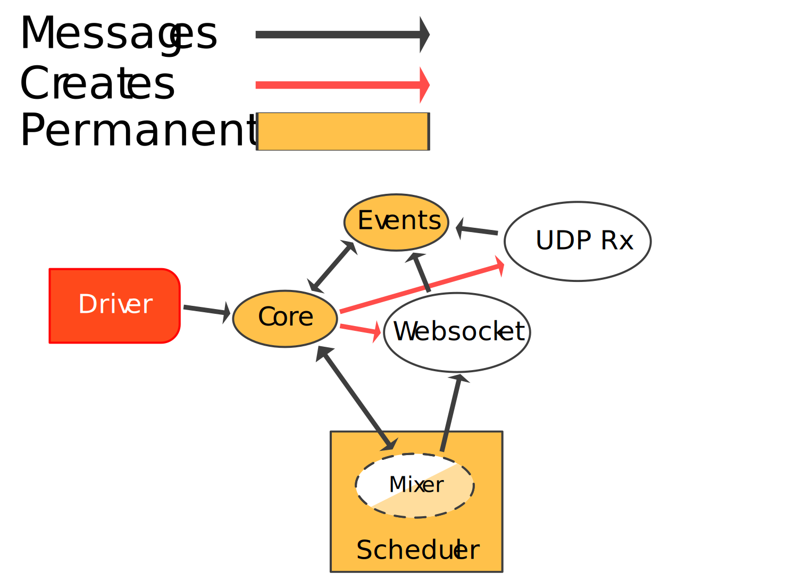

# Summary

Songbird defines two main systems:
* The **gateway**, which communicates with Discord through another client library. This sends voice state updates to join a voice channel, and correlates responses into voice connection info.
* The **driver**, which uses voice connection info to establish an RTP connection and WS signalling channel to send and receive audio. It then manages audio mixing, audio source management, event tracking, and voice packet reception.

Songbird allows users to use one or both of these systems as needed.
Discord voice connections ultimately require both of these to be handled in some way.
In many setups for instance, this comes through using a client-specific wrapper in a bot's host language to collect connection information to send to Lavalink/Lavaplayer, hosted on the JVM.

# Gateway

Explain Songbird
Explain Calls

# Driver

## Tasks

## Input
